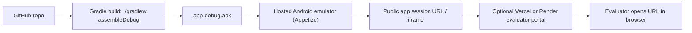
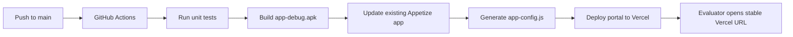

# Deployment Guide

This project is a native Android Jetpack Compose MVP. Do not convert it into a web app for evaluation. The smoothest
deployment model is:

1. Build a signed/debug APK from this repository.
2. Upload that APK to a hosted Android device streaming service.
3. Share a web URL, optionally wrapped in a tiny evaluator portal hosted on Vercel or Render.

The evaluator opens a URL in their browser and interacts with the real Android app running inside a cloud emulator.

## Recommended Architecture



## Why This Fits The MVP

- The product remains a mobile application.
- The evaluator does not need Android Studio.
- The evaluator does not need to download an APK.
- The evaluator does not need a physical Android phone.
- The URL can be shared like a web deployment, but the experience is still a native Android emulator session.

## Build The APK

From the project root:

```powershell
.\gradlew.bat assembleDebug
```

If your terminal says `JAVA_HOME is not set`, use the local helper script instead:

```powershell
.\build-apk.bat
```

The APK will be generated at:

```text
app/build/outputs/apk/debug/app-debug.apk
```

For this fellowship MVP, the debug APK is acceptable because the app uses mock/local data and is not being distributed
through the Play Store. If you later need Play Store distribution, create a proper release keystore and run
`assembleRelease`.

## Primary Deployment Option: Appetize

Use Appetize or a similar hosted Android emulator provider.

High-level steps:

1. Create an account on the hosted emulator service.
2. Upload `app/build/outputs/apk/debug/app-debug.apk`.
3. Select Android as the platform.
4. Pick a phone-like device profile, for example Pixel-style portrait.
5. Enable public sharing, or create a share link.
6. Test the share link in an incognito/private browser window.
7. Send that link to the evaluator.

Recommended session settings:

- Orientation: portrait.
- Device: modern phone profile.
- OS: Android 13+ is fine; Android 15/16 is also fine.
- Network: no special network required.
- Launch package: `com.aistudio.spotify.gmpqlr`.
- Main activity: `com.example.MainActivity`.

## Optional Vercel/Render Evaluator Portal

If the fellowship expects a polished single URL, host the static folder in:

```text
deploy/evaluator-portal
```

The portal is not the app. It is only a wrapper page that embeds or links to the hosted Android emulator session.

For manual deployment, edit:

```text
deploy/evaluator-portal/app-config.js
```

and set the Appetize URL. For CI/CD, do not edit the generated config on every build; let GitHub Actions create it.

## Continuous Deployment

This repository includes:

```text
.github/workflows/deploy-mvp.yml
deploy/evaluator-portal/app-config.js
```

Recommended automated flow:



One-time setup:

1. Create the GitHub repository and push this code.
2. Create one Appetize app manually by uploading the current debug APK.
3. Copy that Appetize app public key.
4. Create a Vercel project for `deploy/evaluator-portal`.
5. Add the required GitHub repository secrets.
6. Push to the `main` branch or run the workflow manually from GitHub Actions.

Required GitHub secrets:

```text
APPETIZE_API_TOKEN
APPETIZE_PUBLIC_KEY
VERCEL_TOKEN
VERCEL_ORG_ID
VERCEL_PROJECT_ID
```

Optional GitHub secret:

```text
APPETIZE_APP_URL
APPETIZE_EMBED_URL
APPETIZE_DEVICE
APPETIZE_OS_VERSION
```

Use `APPETIZE_APP_URL` only if your Appetize public evaluator URL differs from:

```text
https://appetize.io/app/{APPETIZE_PUBLIC_KEY}
```

Use `APPETIZE_EMBED_URL` only if Appetize provides a dedicated iframe URL. The normal share link and the iframe link are
not the same:

```text
Open in new tab: https://appetize.io/app/{APPETIZE_PUBLIC_KEY}
Embed in portal: https://appetize.io/embed/{BuildId-or-PublicKey}
```

If the portal iframe shows `appetize.io refused to connect`, it usually means the iframe is using the normal `/app/...`
share URL instead of the `/embed/...` URL.

The workflow also pins the evaluator device to match the intended mobile experience:

```text
Device: Pixel 9 Pro
URL value: pixel9pro
OS: Android 16.0
URL value: 16.0
Orientation: portrait
```

These values are appended to both the Appetize open link and iframe link. Override them only if needed with:

```text
APPETIZE_DEVICE
APPETIZE_OS_VERSION
```

Important: the workflow updates an existing Appetize app instead of creating a new app each time. That keeps the
mobile-session URL stable while the APK behind it changes.

## Manual Vercel Static Deployment

1. Push this repository to GitHub.
2. Open Vercel.
3. Import the repository.
4. Set the project root/directory to:

```text
deploy/evaluator-portal
```

5. Use static site defaults. No build command is required.
6. Deploy.
7. Open the Vercel URL and confirm the emulator loads.

## Manual Render Static Deployment

1. Push this repository to GitHub.
2. Open Render.
3. Create a new Static Site.
4. Select this repository.
5. Set the publish directory to:

```text
deploy/evaluator-portal
```

6. Leave build command blank, or use:

```text
echo "static"
```

7. Deploy.
8. Open the Render URL and confirm the emulator loads.

## Fallback Options

### Google Play Internal Testing

Good for realistic mobile-device testing, but the evaluator must install the app on an Android device. This does not
match the "no APK download" requirement as well as hosted emulator streaming.

### Firebase App Distribution

Good for tester management, but the evaluator still installs the APK on a phone. Use this only if the evaluator agrees
to install an app.

### BrowserStack App Live

Good for manual QA on many real devices. Depending on your plan, sharing a public evaluator link may be less direct than
Appetize-style public embedding.

## Pre-Evaluation Checklist

- Run `.\gradlew.bat testDebugUnitTest`.
- Run `.\gradlew.bat assembleDebug`.
- Upload the latest `app-debug.apk`.
- Open the hosted emulator link in a private browser window.
- Confirm the app starts on the Mood Board screen.
- Confirm "Go to home" works.
- Confirm selecting a mood shows Home/Music with "Right Now For You".
- Confirm bottom navigation works.
- Confirm mini player/full player can open.
- Confirm the evaluator URL does not require login.

## Current App Identity

```text
Application ID: com.aistudio.spotify.gmpqlr
Main Activity:  com.example.MainActivity
Minimum SDK:    24
Target SDK:     36
```
